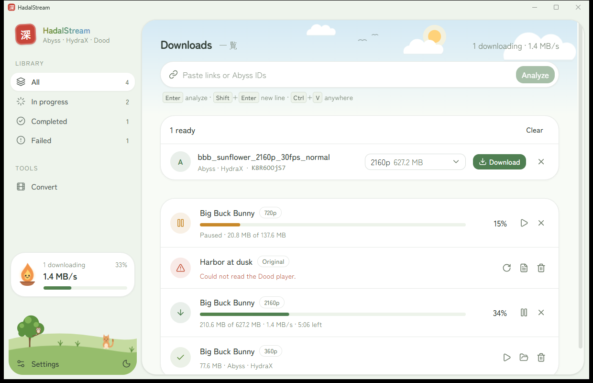
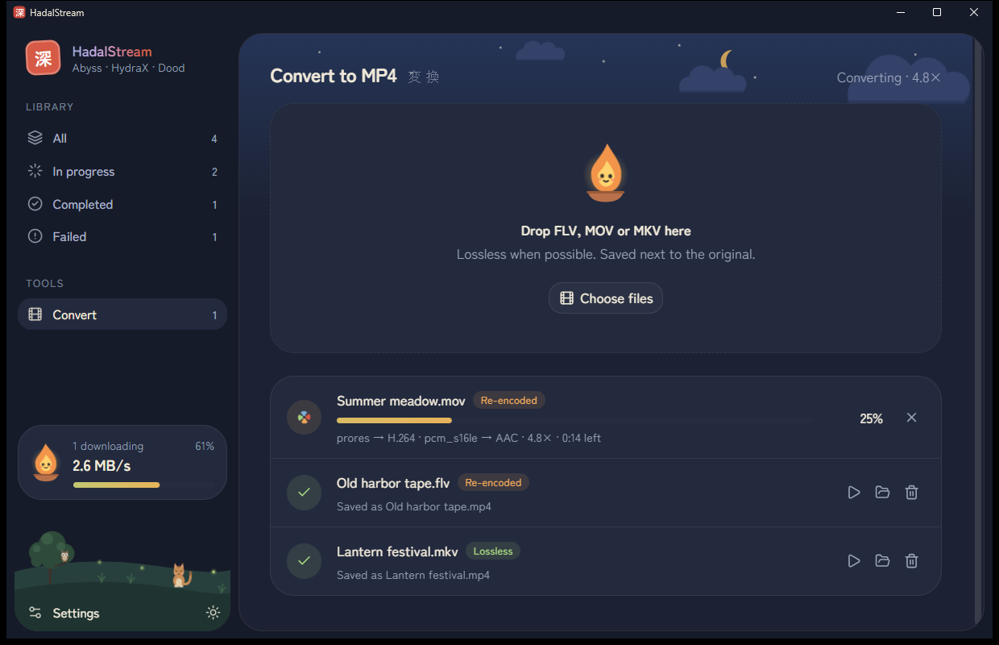
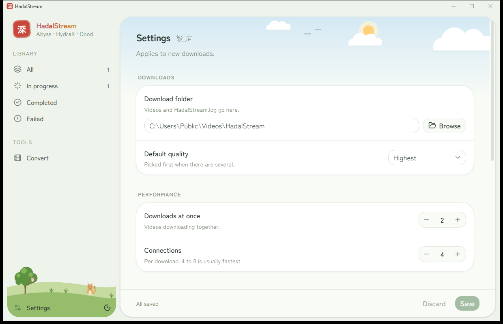

# HadalStream

A Windows desktop app for saving videos from supported web players and converting **FLV / MOV / MKV** files to MP4 without quality loss.

> The name comes from the _hadal zone_, the ocean layer below the _abyssal_ one.

Paste a link and HadalStream recognizes the player, lists the available qualities and downloads over parallel, resumable connections. The converter keeps every stream MP4 already supports and re-encodes only the rest, so most files finish in seconds with no quality loss.

Supported players: **Abyss** (including HydraX links) and **DoodStream**.

| Convert to MP4 (Night)                                                             | Settings (Day)                                                   |
| ---------------------------------------------------------------------------------- | ---------------------------------------------------------------- |
|  |  |

## Features

- **Download**: paste an embed link, a page link or an Abyss ID (or press <kbd>Ctrl</kbd>+<kbd>V</kbd> anywhere). The app finds the video, shows its ID and qualities, then downloads over parallel connections with pause, resume, retry and a queue. Downloads survive app restarts.
- **Convert to MP4** (separate tab): drop or pick FLV/MOV/MKV files. Streams MP4 supports are copied as-is (lossless, seconds). Only incompatible ones are re-encoded at visually lossless quality (H.264 CRF 18 / AAC 256k). The MP4 is saved next to the original.
- **Desktop app**: one-click installer, Day/Night themes with a hand-drawn meadow, sky and little characters (original art, no third-party characters), taskbar progress, error log `HadalStream.log` in your download folder.
- **Settings**: download folder, default quality, simultaneous downloads, connections, proxy, custom headers.

## Responsible use

HadalStream is meant for videos you own, have permission to download, or that are licensed for it (for example Creative Commons or public domain).

- Follow the terms of service of the sites you use and the copyright law where you live.
- DRM-protected streams (Widevine, PlayReady, FairPlay) are not supported.
- HadalStream is an independent project, not affiliated with or endorsed by Abyss, HydraX or DoodStream. Their names are used only to describe compatibility.
- The software is provided as is, without warranty. You are responsible for how you use it.

## Install

Run `releases/HadalStream-win-Setup.exe`. It installs per user (no admin), adds shortcuts, and installs WebView2 if needed. .NET and FFmpeg are bundled. Uninstall from **Settings → Apps**. Requires Windows 10/11 x64.

Settings and the download queue live in `%LocalAppData%\HadalStream`.

## Build

Requires [.NET 10 SDK](https://dotnet.microsoft.com/download), [Node.js 22+](https://nodejs.org/) and, for releases, `dotnet tool install -g vpk`. The first build downloads FFmpeg 9.0.2 (SHA-256 pinned in `HadalStream.Infrastructure.csproj`).

Double-click a script in `commands/`:

| Script        | Does                                                                                                     |
| ------------- | -------------------------------------------------------------------------------------------------------- |
| `run.cmd`     | Builds the UI and starts the app                                                                         |
| `dev.cmd`     | Opens the UI with hot reload in a second window, then the app pointing at it. Close both windows to stop |
| `test.cmd`    | Runs the tests                                                                                           |
| `release.cmd` | Builds the installer (see [Release](#release))                                                           |

Behind a TLS-inspecting proxy, add the user environment variable `NODE_OPTIONS=--use-system-ca` so npm can connect.

## Release

Double-click `commands/release.cmd` and enter a version higher than every one already in `releases/` (for example `1.0.1`). It builds the UI, bundles .NET and FFmpeg, packs the installer and opens `releases/`.

Output in `releases/`:

| File                                                                     | Use                                            |
| ------------------------------------------------------------------------ | ---------------------------------------------- |
| `HadalStream-win-Setup.exe`                                              | Installer to share (always the newest version) |
| `HadalStream-win-Portable.zip`                                           | No-install version                             |
| `HadalStream-<version>-full.nupkg`, `-delta.nupkg`, `RELEASES`, `*.json` | Velopack update packages, kept per version     |

To rebuild the same version, delete `releases/` first.

## How it works

- **App**: WPF window hosting the React UI (`src/web`) in WebView2. They talk through `postMessage`; there is no local server or open port.
- **Abyss / HydraX**: reads the player configuration embedded in the video page to list the qualities, then requests the video in 2 MB segments the same way the web player does.
- **DoodStream**: follows the embed player's `/pass_md5` flow to the file, then downloads it in parallel 2 MB ranges.
- **Converter**: reads streams with `ffmpeg -i`, then copies, re-encodes, or drops each one (image subtitles, fonts, cover art) and writes a fast-start MP4.

## Architecture

Clean Architecture, dependencies point inward:

| Project                      | Contains                                                                                                                                                                         |
| ---------------------------- | -------------------------------------------------------------------------------------------------------------------------------------------------------------------------------- |
| `HadalStream.Domain`         | `Result` / `Error`, entities with guarded state changes (`DownloadJob`, `ConversionJob`), MP4 stream planning, link detection, settings rules. No dependencies.                  |
| `HadalStream.Application`    | Use cases as MediatR requests and handlers (`ResolveLinks`, `AddDownloads`, `SaveSettings`, ...), ports (`IVideoSource`, `IDownloadQueue`, ...) and a logging pipeline behavior. |
| `HadalStream.Infrastructure` | Abyss and Dood sources, download and conversion queues, FFmpeg, JSON storage, error log, Windows shell.                                                                          |
| `HadalStream.Desktop`        | WPF window, WebView2 bridge (`MainWindow.Bridge.cs`) that turns UI messages into MediatR requests, composition root.                                                             |

Expected failures travel as `Result` values; exceptions are reserved for the unexpected and logged once by the pipeline.

## Credits

- [abdlhay/AbyssVideoDownloader](https://github.com/abdlhay/AbyssVideoDownloader) (Apache-2.0): Abyss/HydraX protocol, ported to C#. [kai261199's fork](https://github.com/kai261199/AbyssVideoDownloader) was the initial reference.
- [Gujal00/ResolveURL](https://github.com/Gujal00/ResolveURL) (GPL-2.0): DoodStream flow and mirror domains.
- [FFmpeg](https://ffmpeg.org/) 9.0.2 essentials build by [gyan.dev](https://www.gyan.dev/ffmpeg/builds/) (GPLv3, unmodified). License shipped as `ffmpeg/LICENSE`; source at [FFmpeg@946fcce07b](https://github.com/FFmpeg/FFmpeg/commit/946fcce07b).
- [NIST SP 800-38A](https://csrc.nist.gov/pubs/sp/800/38/a/final): AES-CTR test vectors.
- [MediatR](https://github.com/jbogard/MediatR) 12.5.0, the last Apache-2.0 release (13+ needs a commercial license).
- [Emil Kowalski](https://emilkowal.ski/) design principles ([emilkowalski/skills](https://github.com/emilkowalski/skills), MIT) and the review skills in `.agents/skills`.
- Built with WebView2, Velopack, React, Vite, Tailwind CSS, shadcn/ui, Radix UI, Lucide, Sonner and [Zen Maru Gothic](https://fonts.google.com/specimen/Zen+Maru+Gothic) (SIL OFL). Illustrations (meadow, sky, acorn sprite, cat, owl, flame spirit, pinwheel) and the seal icon are original.
